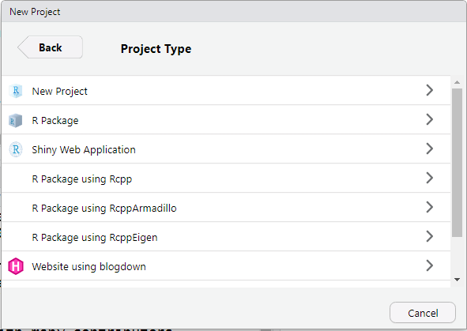
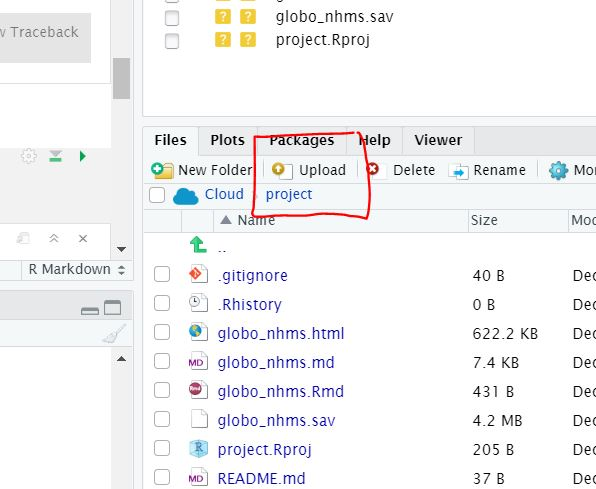

```{r setup, include=FALSE}
options(htmltools.dir.version = FALSE)
```


class: inverse, center, middle

# What we will cover today?

---

## R and RStudio
## RStudio Cloud
## Installation for R and RStudio
## Optional installation for Miktex or Texlive and MacTex  
## R scripts, R packages, R Taskview

## Live-coding (partial)

---

# RStudio Cloud

- Anyone can sign up

- Using RStudio on the cloud

- Perhaps one of the quickest way to learn R

- Do not need to install R on your machine (for this lecture)

- Allows collaborration. 

- Facilitate learning. Free for now 

- Go here <https://rstudio.cloud/>

---

# RStudio Cloud

## Interface

.centre.shrink[]

---

# RStudio Cloud

## Sign up and Log in (Please Sign Up, Now). This take around 5 mins

.centre.shrink[]

---

# Point and click R GUI

## A number of SPSS like GUI for R

- <https://www.blueskystatistics.com/>

.center.shrink[]

---

# Point and click R GUI

- <https://www.jamovi.org/>

.center.shrink[]

---

# RStudio Server

- You can install R and RStudio on the server
  - RStudio Server
  
- Doing analysis on the server 

- Give a taste of working on BIG DATA
  
- Two versions of RStudio Server
  - RStudio Server 
  - RStudio Server Professional 
  
- For example:
  - <https://healthdata.usm.my/rstudio/auth-sign-in>
  
---

class: inverse, center, middle

# Installation 

## You have to have **Admin Right** to your machine

---

class: inverse, center, middle

# Installation (Do this at home on your machine)

## R
## RStudio
## MiKTeX, TeXLive and MacTex (optional)

---

# Installation for R

We need to install two software (at least)

Install the **R** software from [cran](https://cran.r-project.org/). 

- choose R version for your machine OS
- Windows OS <https://cran.r-project.org/bin/windows/base/R-3.6.1-win.exe>
- Mac OS <https://cran.r-project.org/bin/macosx/R-3.6.1.pkg>
- Linux: then choose your flavour

.right[]

---

# Installation for RStudio

- Install RStudio for your OS from here <https://www.rstudio.com/products/rstudio/download/#download>
- Choose the supported platforms
- size around 70-90 MB

.right[]

---

# Check R and RStudio on your machine

## Do you have R? what version?
## Do you have RStudio? what version?
## Do you need to update?


---

# Installation of MiKTeX, TeXLive and MacTex

- necessary to convert the outputs to pdf
- will use this for RMarkdown

.right[]

---

## MiKTeX, for Window OS 

.right[]

---

## MacTeX, for Mac OS

.right[]

---

# Progress?

## R 

- R OK?

## RStudio 
- RStudio OK?

## MikTeX or MacTex (optional)

- MiKTeX, TeXLive and MacTeX ready?

---

class: inverse, center, middle

# Hands-On (2 options): Start your RStudio 

## Login to RStudio Cloud
## OR
## Start RStudio on your machine

---

# Login to RStudio Cloud 

## <https://rstudio.cloud>

- username
- password 

Click this link <https://posit.cloud/spaces/346031/join?access_code=bXIJZHLLSqvkG-Kuk3K1D8JXiIyErmPsAPTUjC69>

---

# Login to Rstudio Cloud

.center.shrink[]

---

# Start R on your machine

- Find Rstudio in your machine


---

# What you see on RStudio

- There will be 3 panes if you start Rstudio for the first time
- 4 panes if you have used RStudio before

.right[]

---

## Console tab

- this is where we will see most of the results

.right[]

---

## Files, Plots, Packages, Help and Viewer Pane 

- List of objects
- R files, datasets, tables, list etc 

.right[]

---

## Environment, History, Connection and Build Pane

.right[]

---

## Source Pane 

- this is where we will create files and write our codes

.right[]


---

# Open a new R script

- File -> R Script
- In Window OS, CTRL-SHIFT-N


.right[]

---

# Our first R script

## First script

- In Line 1, type `2 + 3` 
- click CTRL-ENTER or CMD-ENTER 
- see the outputs in the Console Pane

```{r}
2 + 3
```

---

## Saving R script

### For future use

- File ->
- Save As ->
- Choose folder ->  
- Name the file


---

# Check version of R

```{r}
version[6:7]
```

The current version for R is `r version[6:7]`

If you lower version, then you want to upgrade. To upgrade

- for Windows, you can use **installr** package
- for Mac OS, you can use some functions 

More info here <https://www.linkedin.com/pulse/3-methods-update-r-rstudio-windows-mac-woratana-ngarmtrakulchol/>

---

## function, argument and parameters

```
f <- function(<arguments>) {
## Do something interesting
}
```
For example, for the function `lm()` to estimate parameters for linear regression model

```{r}
args(lm)
```

---

For example:

```{r}
lm(weight ~ Time, data = ChickWeight)
```

Ref: 

- <https://www.stat.auckland.ac.nz/~ihaka/downloads/Waikato-WRUG.pdf>
- <https://www.stat.berkeley.edu/~statcur/Workshop2/Presentations/functions.pdf> 


---

## Need more help?

Then type the ? before the function

```{r}
?lm
```

See what will be displayed in Help Pane

.right[]

---
class: inverse, center, middle

# Packages

---

# Packages on CRAN

<https://cran.r-project.org/>

- Currently, the CRAN package repository features 12784 available packages
- Cran Task Views 


---

# Check if the package you need is available in your R library

Type this inside your console

```{r}
library(ggplot2)
```

- You should not receive any error message. 
- If you have not installed the package, you will receive and error message. And it tells you that the package is not available in your R.
- the package is stored in the R folder in your My Document or HOME directory

```{r}
.libPaths()
```


---

# Install an R package 

- To install an R package, you can type below (without the # tag)

```{r}
# install.packages(foreign, dependencies = TRUE)
```

- You need to have internet access
- You can install from a zip file (from your machine or USB), from github and other repo

---

class: inverse, center, middle

# Directory

---

# Directory

This is important. Not knowing your working directory will make you lost

- You must know where your folder is located
- The folder can contain many sub folders
- The folder should contain dataset (if you want to analyze your data)
- It will later store the objects created during R session

```{r}
getwd()
```

- You have to know to write file path. It is written differently for Window OS and other OS

---

# Starting your R job

There are 2 ways to start your job

- create a new project (recommended)
- setting your working directory using `setwd()` (not recommended)

---

# Create new project

- Always create a new project (This is the recommended way)
- Go to `File -> New Project`

## Directory

.right[]

---

## Project type

### Click New Project

.right[]


---


# Where is my data?

- in (usually) data frame form
- See the environment pane
- Your data is now in memory (RAM)
- How much your RAM for your machine?
- The data will be gone once you close RStudio
- But it will not change your original data (so be happy!)


---

# Upload data to RStudio Cloud

## You have to upload data to RStudio Cloud
## Or link data to dropbox folder



---

# More resources on RStudio Cloud

## YouTube : RStudio Cloud for education 

<https://www.youtube.com/watch?v=PviVimazpz8>

## YouTube: Working with R in Cloud

<https://www.youtube.com/watch?v=SFpzr21Pavg>

---
# Need help

If you need help you can

-  Type a question mark infront of a function

```{r}
?plot
```

- register and join RStudio Community here <https://community.rstudio.com/>
- Ask questions on Stack Overflow <https://stackoverflow.com/>
- Search for mailing list and subscribe to it
- Books on R <https://bookdown.org/>

---

## Bookdown

 <https://bookdown.org/>
 
 

<!-- TO PRINT to PDF type pagedown::chrome_print("Intro2.html") -->

---
# Questions and contacts

.pull-left[
Twitter : @kamarul_imran

Email : drki.musa@gmail.com 


]

.pull-right[

]

---
layout: false
class: inverse, center, middle

# **Enjoy!**

Slides created via the R package [**xaringan**](https://github.com/yihui/xaringan).
